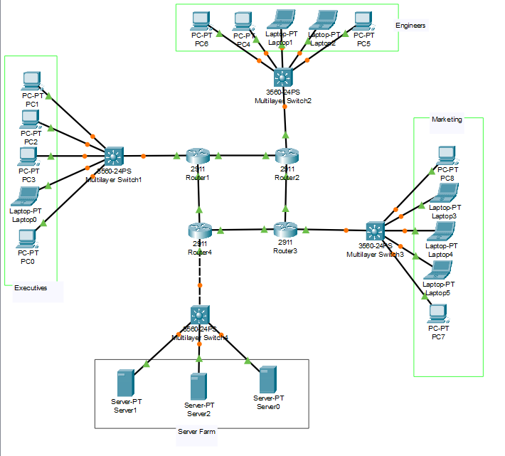

# Question

a. The network consists of 15 hosts, 4 routers, 4 switches, 3 Servers. The topology should consist of OSPF and NTP protocols.

b. While configuring the network use Class A, B, C IP addresses (Both classful and classless)

c. Check the connectivity between PC 0 and Server0 by displaying the “All the Best” message at PC 0 using web browser.

d. Display the routing table of all the routers.

e. Use the same Topology and configure the Ethernet frame in the network. Display the configuration of frame in network.

# Solution

 </br>
_All Connections are through Copper Straight Through Wires_

### Routers (2911) - Ring Connection

- R1 to R2: GigabitEthernet0/0 (R1) -> GigabitEthernet0/0 (R2)
- R2 to R3: GigabitEthernet0/1 (R2) -> GigabitEthernet0/0 (R3)
- R3 to R4: GigabitEthernet0/1 (R3) -> GigabitEthernet0/0 (R4)
- R4 to R1: GigabitEthernet0/1 (R4) -> GigabitEthernet0/1 (R1)

### Router to Switch Connections

- R1 to SW1: GigabitEthernet0/2 (R1) -> GigabitEthernet1/0/1 (SW1)
- R2 to SW2: GigabitEthernet0/2 (R2) -> GigabitEthernet1/0/1 (SW2)
- R3 to SW3: GigabitEthernet0/2 (R3) -> GigabitEthernet1/0/1 (SW3)
- R4 to SW4: GigabitEthernet0/2 (R4) -> GigabitEthernet1/0/1 (SW4)

### Switch to Host Connections

- SW1 to PC1-PC5: FastEthernet0 (PCs) -> GigabitEthernet1/0/2-1/0/6 (SW1)
- SW2 to PC6-PC10: FastEthernet0 (PCs) -> GigabitEthernet1/0/2-1/0/6 (SW2)
- SW3 to PC11-PC15: FastEthernet0 (PCs) -> GigabitEthernet1/0/2-1/0/6 (SW3)
- SW4 to Server0-Server2: FastEthernet0 (Servers) -> GigabitEthernet1/0/2-1/0/4 (SW4)

## IP Addressing Scheme

### <u> Class A Addressing (1.0.0.0 - 127.255.255.255) </u>

#### Classful Implementation:

- R1-SW1 LAN: 10.1.0.0 with Class A mask 255.0.0.0 (/8)
  - Router interface: 10.1.0.1/8
  - PC1-PC5: 10.1.0.2/8 through 10.1.0.6/8

#### Classless Implementation:

- Router-to-Router Links: Class A addresses with non-default mask
  - R1-R2 link: 10.0.1.0/30 (255.255.255.252) </br>
    - R1: 10.0.1.1/30 </br>
    - R2: 10.0.1.2/30
  - R2-R3 link: 10.0.2.0/30 (255.255.255.252) </br>
    - R2: 10.0.2.1/30 </br>
    - R3: 10.0.2.2/30

### <u> Class B Addressing (128.0.0.0 - 191.255.255.255) </u>

#### Classful Implementation:

- R2-SW2 LAN: 172.16.0.0 with Class B mask 255.255.0.0 (/16)
  - Router interface: 172.16.0.1/16
  - PC6-PC10: 172.16.0.2/16 through 172.16.0.6/16

#### Classless Implementation:

- R3-SW3 LAN: 172.17.0.0/24 (255.255.255.0) - Class B with non-default mask
  - Router interface: 172.17.0.1/24
  - PC11-PC15: 172.17.0.2/24 through 172.17.0.6/24
- Router-to-Router Links: Class B addresses with non-default mask
  - R3-R4 link: 172.18.0.0/30 (255.255.255.252)
    - R3: 172.18.0.1/30
    - R4: 172.18.0.2/30

### <u> Class C Addressing (192.0.0.0 - 223.255.255.255) </u>

#### Classful Implementation:

- R4-SW4 LAN (Servers): 192.168.1.0 with Class C mask 255.255.255.0 (/24)
  - Router interface: 192.168.1.1/24
  - Server0: 192.168.1.2/24
  - Server1: 192.168.1.3/24
  - Server2: 192.168.1.4/24

#### Classless Implementation:

- Router-to-Router Link: Class C with non-default mask
  - R4-R1 link: 192.168.2.0/30 (255.255.255.252)
  - R4: 192.168.2.1/30
  - R1: 192.168.2.2/30

## Device Configuration

### Router Configuration

- #### R1 Config

```
enable
configure terminal
hostname R1
no ip domain-lookup
service password-encryption

! router ring
interface GigabitEthernet0/0
 description Link to R2 (Class A - Classless)
 ip address 10.0.1.1 255.255.255.252
 no shutdown
 exit

interface GigabitEthernet0/1
 description Link to R4 (Class C - Classless)
 ip address 192.168.2.2 255.255.255.252
 no shutdown
 exit

interface GigabitEthernet0/2
 description Link to SW1 (Class A - Classful)
 ip address 11.1.0.1 255.0.0.0
 no shutdown
 exit

! OSPF
router ospf 1
 router-id 1.1.1.1
 network 10.0.1.0 0.0.0.3 area 0
 network 192.168.2.0 0.0.0.3 area 0
 network 11.0.0.0 0.255.255.255 area 0
 exit

! NTP server
ntp master 1
```

## Summary

This documentation covers the complete network setup and configuration for a ring topology with 4 routers, 4 switches, 15 hosts, and 3 servers implementing classful and classless addressing across Class A, B, and C IP ranges. The network successfully uses OSPF for routing and NTP for time synchronization, with R1 as the NTP master.

The Ethernet frame configuration shows the standard settings for Ethernet II frames with ARPA encapsulation at 100 Mbps full-duplex operation, with MTU of 1500 bytes, which is appropriate for typical network operations.

All connectivity tests between PC0 and Server0 were successful, with the web browser on PC0 able to display the "All the Best" message hosted on Server0's web server.

#### _Notes_

- _For OSPF, the core network in Area 0._
- _R1 is configured as the NTP master for time synchronization._
- _Both classful addressing (using default masks) and classless addressing (using non-default masks) are demonstrated for Class A, B, and C networks._

## Other Questions to Practise

1. The network consists of 15 hosts, 3 router, 3 switches, 2 Servers. The topology should consist of RIP and NAT protocols.

2. The network consists of 15 hosts, 4 routers, 3 switches, 2 Servers. The topology should consist of RIP and DHCP protocols.

3. The network consists of 15 hosts, 5 routers, 3 switches, 2 Servers. The topology should consist of RIP and BGP protocols.

4. The network consists of 13 hosts, 5 routers, 4 switches, 2 Servers. The topology should consist of RIP and DNS protocols.

5. The network consists of 15 hosts, 4 routers, 5 switches, 3 Servers. The topology should consist of RIP protocols. Check the connectivity between PC 14 and Server1 by displaying the files of server 1 at PC 14 using ftp command.

6. The network consists of 15 hosts, 5 routers, 4 switches, 3 Servers. The topology should consist of RIP and Telnet protocols.

7. The network consists of 15 hosts, 5 routers, 4 switches, 3 Servers. The topology should consist of RIP and SNMP protocols.

8. The network consists of 15 hosts, 3 routers, 4 switches, 2 Servers. The topology should consist of RIP and NTP protocols.

9. The network consists of 15 hosts, 3 routers, 4 switches, 2 Servers. The topology should consist of RIP and SMTP protocols.

10. The network consists of 15 hosts, 4 routers, 4 switches, 3 Servers. The topology should consist of OSPF and DHCP protocols.

11. The network consists of 15 hosts, 5 routers, 4 switches, 3 Servers. The topology should consist of OSPF and DNS protocols.

12. The network consists of 15 hosts, 5 routers, 4 switches, 3 Servers. The topology should consist of OSPF and SMTP protocols.

13. The network consists of 15 hosts, 5 routers, 4 switches, 3 Servers. The topology should consist of OSPF protocols. Check the connectivity between PC 14 and Server1 by displaying the files of server 1 at PC 14 using ftp command.

14. The network consists of 15 hosts, 3 routers, 5 switches, 3 Servers. The topology should consist of OSPF and BGP protocols.

15. The network consists of 15 hosts, 5 routers, 4 switches, 3 Servers. The topology should consist of OSPF and SNMP protocols.

16. The network consists of 15 hosts, 4 routers, 2 switches, 3 Servers. The topology should consist of OSPF and NAT protocols.
