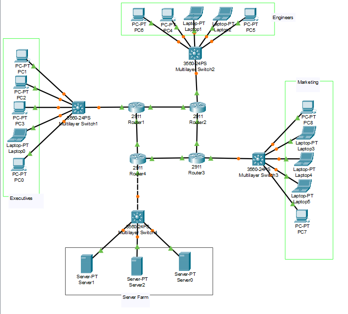

# Question

a. The network consists of 15 hosts, 4 routers, 4 switches, 3 Servers. The topology should consist of OSPF and NTP protocols.

b. While configuring the network use Class A, B, C IP addresses (Both classful and classless)

c. Check the connectivity between PC 0 and Server0 by displaying the “All the Best” message at PC 0 using web browser.

d. Display the routing table of all the routers.

e. Use the same Topology and configure the Ethernet frame in the network. Display the configuration of frame in network.

# Solution

 </br>
_All Connections are through Copper Straight Through Wires_

### Routers (2911) - Ring Connection

- R1 to R2: GigabitEthernet0/0 (R1) -> GigabitEthernet0/0 (R2)
- R2 to R3: GigabitEthernet0/1 (R2) -> GigabitEthernet0/0 (R3)
- R3 to R4: GigabitEthernet0/1 (R3) -> GigabitEthernet0/0 (R4)
- R4 to R1: GigabitEthernet0/1 (R4) -> GigabitEthernet0/1 (R1)

### Router to Switch Connections

- R1 to SW1: GigabitEthernet0/2 (R1) -> GigabitEthernet1/0/1 (SW1)
- R2 to SW2: GigabitEthernet0/2 (R2) -> GigabitEthernet1/0/1 (SW2)
- R3 to SW3: GigabitEthernet0/2 (R3) -> GigabitEthernet1/0/1 (SW3)
- R4 to SW4: GigabitEthernet0/2 (R4) -> GigabitEthernet1/0/1 (SW4)

### Switch to Host Connections

- SW1 to PC1-PC5: FastEthernet0 (PCs) -> GigabitEthernet1/0/2-1/0/6 (SW1)
- SW2 to PC6-PC10: FastEthernet0 (PCs) -> GigabitEthernet1/0/2-1/0/6 (SW2)
- SW3 to PC11-PC15: FastEthernet0 (PCs) -> GigabitEthernet1/0/2-1/0/6 (SW3)
- SW4 to Server0-Server2: FastEthernet0 (Servers) -> GigabitEthernet1/0/2-1/0/4 (SW4)

## IP Addressing Scheme

### <u> Class A Addressing (1.0.0.0 - 127.255.255.255) </u>

#### Classful Implementation:

- R1-SW1 LAN: 10.1.0.0 with Class A mask 255.0.0.0 (/8)
  - Router interface: 10.1.0.1/8
  - PC1-PC5: 10.1.0.2/8 through 10.1.0.6/8

#### Classless Implementation:

- Router-to-Router Links: Class A addresses with non-default mask
  - R1-R2 link: 10.0.1.0/30 (255.255.255.252) </br>
    - R1: 10.0.1.1/30 </br>
    - R2: 10.0.1.2/30
  - R2-R3 link: 10.0.2.0/30 (255.255.255.252) </br>
    - R2: 10.0.2.1/30 </br>
    - R3: 10.0.2.2/30

### <u> Class B Addressing (128.0.0.0 - 191.255.255.255) </u>

#### Classful Implementation:

- R2-SW2 LAN: 172.16.0.0 with Class B mask 255.255.0.0 (/16)
  - Router interface: 172.16.0.1/16
  - PC6-PC10: 172.16.0.2/16 through 172.16.0.6/16

#### Classless Implementation:

- R3-SW3 LAN: 172.17.0.0/24 (255.255.255.0) - Class B with non-default mask
  - Router interface: 172.17.0.1/24
  - PC11-PC15: 172.17.0.2/24 through 172.17.0.6/24
- Router-to-Router Links: Class B addresses with non-default mask
  - R3-R4 link: 172.18.0.0/30 (255.255.255.252)
    - R3: 172.18.0.1/30
    - R4: 172.18.0.2/30

### <u> Class C Addressing (192.0.0.0 - 223.255.255.255) </u>

#### Classful Implementation:

- R4-SW4 LAN (Servers): 192.168.1.0 with Class C mask 255.255.255.0 (/24)
  - Router interface: 192.168.1.1/24
  - Server0: 192.168.1.2/24
  - Server1: 192.168.1.3/24
  - Server2: 192.168.1.4/24

#### Classless Implementation:

- Router-to-Router Link: Class C with non-default mask
  - R4-R1 link: 192.168.2.0/30 (255.255.255.252)
  - R4: 192.168.2.1/30
  - R1: 192.168.2.2/30

## Device Configuration

### Router Configuration (2911)

- #### R1 Config

```
enable
configure terminal
hostname R1
no ip domain-lookup
service password-encryption

! router ring
interface GigabitEthernet0/0
 description Link to R2 (Class A - Classless)
 ip address 10.0.1.1 255.255.255.252
 no shutdown
 exit

interface GigabitEthernet0/1
 description Link to R4 (Class C - Classless)
 ip address 192.168.2.2 255.255.255.252
 no shutdown
 exit

interface GigabitEthernet0/2
 description Link to SW1 (Class A - Classful)
 ip address 11.1.0.1 255.0.0.0
 no shutdown
 exit

! OSPF
router ospf 1
 router-id 1.1.1.1
 network 10.0.1.0 0.0.0.3 area 0
 network 192.168.2.0 0.0.0.3 area 0
 network 11.0.0.0 0.255.255.255 area 0
 exit

! NTP server
ntp master 1
```

- #### R2 Config

```
enable
configure terminal
hostname R2
no ip domain-lookup
service password-encryption

! Interfaces for router ring
interface GigabitEthernet0/0
 description Link to R1 (Class A - Classless)
 ip address 10.0.1.2 255.255.255.252
 no shutdown
 exit

interface GigabitEthernet0/1
 description Link to R3 (Class A - Classless)
 ip address 10.0.2.1 255.255.255.252
 no shutdown
 exit

interface GigabitEthernet0/2
 description Link to SW2 (Class B - Classful)
 ip address 172.16.0.1 255.255.0.0
 no shutdown
 exit

router ospf 1
 router-id 2.2.2.2
 network 10.0.1.0 0.0.0.3 area 0
 network 10.0.2.0 0.0.0.3 area 0
 network 172.16.0.0 0.0.255.255 area 0
 exit

ntp server 11.1.0.1
```

- #### R3 Configuration

```
enable
configure terminal
hostname R3
no ip domain-lookup
service password-encryption

! interfaces for router ring
interface GigabitEthernet0/0
 description Link to R2 (Class A - Classless)
 ip address 10.0.2.2 255.255.255.252
 no shutdown
 exit

interface GigabitEthernet0/1
 description Link to R4 (Class B - Classless)
 ip address 172.18.0.1 255.255.255.252
 no shutdown
 exit

interface GigabitEthernet0/2
 description Link to SW3 (Class B - Classless)
 ip address 172.17.0.1 255.255.255.0
 no shutdown
 exit

router ospf 1
 router-id 3.3.3.3
 network 10.0.2.0 0.0.0.3 area 0
 network 172.18.0.0 0.0.0.3 area 0
 network 172.17.0.0 0.0.0.255 area 0
 exit

ntp server 11.1.0.1
```

- #### R4 Configuration

```
enable
configure terminal
hostname R4
no ip domain-lookup
service password-encryption

! Configure interfaces for router ring
interface GigabitEthernet0/0
 description Link to R3 (Class B - Classless)
 ip address 172.18.0.2 255.255.255.252
 no shutdown
 exit

interface GigabitEthernet0/1
 description Link to R1 (Class C - Classless)
 ip address 192.168.2.1 255.255.255.252
 no shutdown
 exit

interface GigabitEthernet0/2
 description Link to SW4 (Class C - Classful)
 ip address 192.168.1.1 255.255.255.0
 no shutdown
 exit

router ospf 1
 router-id 4.4.4.4
 network 172.18.0.0 0.0.0.3 area 0
 network 192.168.2.0 0.0.0.3 area 0
 network 192.168.1.0 0.0.0.255 area 0
 exit

ntp server 11.1.0.1
```

### Switch Configuration (3560 - 24 PS)

- #### SW1 configuration

```
enable
configure terminal
hostname SW1
no ip domain-lookup

! interface to router
interface GigabitEthernet0/1
 description Link to R1
 no shutdown
 exit

! interfaces to PCs
interface range FastEthernet0/2-6
 description Links to PC1-PC5
 no shutdown
 exit
```

- #### SW2, SW3, SW4 configuration

```
Exactly the same as done for SW1
```

### PC And Server (End - Device) Configuration

- PC1 to 5 (Class A - Classful)
  - IP address: 11.1.0.2-6
  - Subnet mask: 255.0.0.0
  - Default gateway: 11.1.0.1
- For PC6-PC10 (Class B - Classful):
  - IP address: 172.16.0.2-6
  - Subnet mask: 255.255.0.0
  - Default gateway: 172.16.0.1
- For PC11-PC15 (Class B - Classless):
  - IP address: 172.17.0.2-6
  - Subnet mask: 255.255.255.0
  - Default gateway: 172.17.0.1
- For servers (Class C - Classful):
  - Server0: 192.168.1.2/24
  - Server1: 192.168.1.3/24
  - Server2: 192.168.1.4/24
  - Default gateway: 192.168.1.1

_Remaining Class A and C (Classless) have been covered in Router Configuration._

### Web Server Configuration

_Doing it on Server 1 (192.168.1.2)_

- Open Service Tab, Turn on HTTP Service
- Edit index.html

```
<html>
<center><font size='+2' color='blue'>All the Best</font></center>
<hr>All the Best. Here's to opening doors to new opportunities.
<p>Quick Links for Reference:
<br><a href='helloworld.html'>A small page</a>
<br><a href='copyrights.html'>Copyrights</a>
<br><a href='image.html'>Image page</a>
<br><a href='cscoptlogo177x111.jpg'>Image</a>
</html>
```

#### To Verify

- Any PC on the network, go to the web browser and type http://192.168.1.2, the output is:


## Display Routing Table

### On all routers R1, R2, R3, R4

`show ip route`

- #### R1

```
R1>show ip route
Codes: L - local, C - connected, S - static, R - RIP, M - mobile, B - BGP
       D - EIGRP, EX - EIGRP external, O - OSPF, IA - OSPF inter area
       N1 - OSPF NSSA external type 1, N2 - OSPF NSSA external type 2
       E1 - OSPF external type 1, E2 - OSPF external type 2, E - EGP
       i - IS-IS, L1 - IS-IS level-1, L2 - IS-IS level-2, ia - IS-IS inter area
       * - candidate default, U - per-user static route, o - ODR
       P - periodic downloaded static route

Gateway of last resort is not set

     10.0.0.0/8 is variably subnetted, 3 subnets, 2 masks
C       10.0.1.0/30 is directly connected, GigabitEthernet0/0
L       10.0.1.1/32 is directly connected, GigabitEthernet0/0
O       10.0.2.0/30 [110/2] via 10.0.1.2, 08:01:52, GigabitEthernet0/0
     11.0.0.0/8 is variably subnetted, 2 subnets, 2 masks
C       11.0.0.0/8 is directly connected, GigabitEthernet0/2
L       11.1.0.1/32 is directly connected, GigabitEthernet0/2
O    172.16.0.0/16 [110/2] via 10.0.1.2, 08:01:52, GigabitEthernet0/0
     172.17.0.0/24 is subnetted, 1 subnets
O       172.17.0.0/24 [110/3] via 192.168.2.1, 00:21:24, GigabitEthernet0/1
                      [110/3] via 10.0.1.2, 00:21:24, GigabitEthernet0/0
     172.18.0.0/30 is subnetted, 1 subnets
O       172.18.0.0/30 [110/2] via 192.168.2.1, 00:21:24, GigabitEthernet0/1
O    192.168.1.0/24 [110/2] via 192.168.2.1, 00:21:24, GigabitEthernet0/1
     192.168.2.0/24 is variably subnetted, 2 subnets, 2 masks
C       192.168.2.0/30 is directly connected, GigabitEthernet0/1
L       192.168.2.2/32 is directly connected, GigabitEthernet0/1
```

- #### R2

```
R2>show ip route
Codes: L - local, C - connected, S - static, R - RIP, M - mobile, B - BGP
       D - EIGRP, EX - EIGRP external, O - OSPF, IA - OSPF inter area
       N1 - OSPF NSSA external type 1, N2 - OSPF NSSA external type 2
       E1 - OSPF external type 1, E2 - OSPF external type 2, E - EGP
       i - IS-IS, L1 - IS-IS level-1, L2 - IS-IS level-2, ia - IS-IS inter area
       * - candidate default, U - per-user static route, o - ODR
       P - periodic downloaded static route

Gateway of last resort is not set

     10.0.0.0/8 is variably subnetted, 4 subnets, 2 masks
C       10.0.1.0/30 is directly connected, GigabitEthernet0/0
L       10.0.1.2/32 is directly connected, GigabitEthernet0/0
C       10.0.2.0/30 is directly connected, GigabitEthernet0/1
L       10.0.2.1/32 is directly connected, GigabitEthernet0/1
O    11.0.0.0/8 [110/2] via 10.0.1.1, 08:02:17, GigabitEthernet0/0
     172.16.0.0/16 is variably subnetted, 2 subnets, 2 masks
C       172.16.0.0/16 is directly connected, GigabitEthernet0/2
L       172.16.0.1/32 is directly connected, GigabitEthernet0/2
     172.17.0.0/24 is subnetted, 1 subnets
O       172.17.0.0/24 [110/2] via 10.0.2.2, 08:02:17, GigabitEthernet0/1
     172.18.0.0/30 is subnetted, 1 subnets
O       172.18.0.0/30 [110/2] via 10.0.2.2, 08:02:17, GigabitEthernet0/1
O    192.168.1.0/24 [110/3] via 10.0.2.2, 08:02:17, GigabitEthernet0/1
                    [110/3] via 10.0.1.1, 08:02:17, GigabitEthernet0/0
     192.168.2.0/30 is subnetted, 1 subnets
O       192.168.2.0/30 [110/2] via 10.0.1.1, 08:02:17, GigabitEthernet0/0
```

- #### R3

```
R3>show ip route
Codes: L - local, C - connected, S - static, R - RIP, M - mobile, B - BGP
       D - EIGRP, EX - EIGRP external, O - OSPF, IA - OSPF inter area
       N1 - OSPF NSSA external type 1, N2 - OSPF NSSA external type 2
       E1 - OSPF external type 1, E2 - OSPF external type 2, E - EGP
       i - IS-IS, L1 - IS-IS level-1, L2 - IS-IS level-2, ia - IS-IS inter area
       * - candidate default, U - per-user static route, o - ODR
       P - periodic downloaded static route

Gateway of last resort is not set

     10.0.0.0/8 is variably subnetted, 3 subnets, 2 masks
O       10.0.1.0/30 [110/2] via 10.0.2.1, 00:18:21, GigabitEthernet0/0
C       10.0.2.0/30 is directly connected, GigabitEthernet0/0
L       10.0.2.2/32 is directly connected, GigabitEthernet0/0
O    11.0.0.0/8 [110/3] via 10.0.2.1, 00:18:21, GigabitEthernet0/0
                [110/3] via 172.18.0.2, 00:18:21, GigabitEthernet0/1
O    172.16.0.0/16 [110/2] via 10.0.2.1, 00:18:21, GigabitEthernet0/0
     172.17.0.0/16 is variably subnetted, 2 subnets, 2 masks
C       172.17.0.0/24 is directly connected, GigabitEthernet0/2
L       172.17.0.1/32 is directly connected, GigabitEthernet0/2
     172.18.0.0/16 is variably subnetted, 2 subnets, 2 masks
C       172.18.0.0/30 is directly connected, GigabitEthernet0/1
L       172.18.0.1/32 is directly connected, GigabitEthernet0/1
O    192.168.1.0/24 [110/2] via 172.18.0.2, 00:18:21, GigabitEthernet0/1
     192.168.2.0/30 is subnetted, 1 subnets
O       192.168.2.0/30 [110/2] via 172.18.0.2, 00:18:21, GigabitEthernet0/1
```

- #### R4

```
R4>show ip route
Codes: L - local, C - connected, S - static, R - RIP, M - mobile, B - BGP
       D - EIGRP, EX - EIGRP external, O - OSPF, IA - OSPF inter area
       N1 - OSPF NSSA external type 1, N2 - OSPF NSSA external type 2
       E1 - OSPF external type 1, E2 - OSPF external type 2, E - EGP
       i - IS-IS, L1 - IS-IS level-1, L2 - IS-IS level-2, ia - IS-IS inter area
       * - candidate default, U - per-user static route, o - ODR
       P - periodic downloaded static route

Gateway of last resort is not set

     10.0.0.0/30 is subnetted, 2 subnets
O       10.0.1.0/30 [110/2] via 192.168.2.2, 08:00:57, GigabitEthernet0/1
O       10.0.2.0/30 [110/2] via 172.18.0.1, 08:00:57, GigabitEthernet0/0
O    11.0.0.0/8 [110/2] via 192.168.2.2, 08:00:57, GigabitEthernet0/1
O    172.16.0.0/16 [110/3] via 172.18.0.1, 08:00:57, GigabitEthernet0/0
                   [110/3] via 192.168.2.2, 08:00:57, GigabitEthernet0/1
     172.17.0.0/24 is subnetted, 1 subnets
O       172.17.0.0/24 [110/2] via 172.18.0.1, 08:00:57, GigabitEthernet0/0
     172.18.0.0/16 is variably subnetted, 2 subnets, 2 masks
C       172.18.0.0/30 is directly connected, GigabitEthernet0/0
L       172.18.0.2/32 is directly connected, GigabitEthernet0/0
     192.168.1.0/24 is variably subnetted, 2 subnets, 2 masks
C       192.168.1.0/24 is directly connected, GigabitEthernet0/2
L       192.168.1.1/32 is directly connected, GigabitEthernet0/2
     192.168.2.0/24 is variably subnetted, 2 subnets, 2 masks
C       192.168.2.0/30 is directly connected, GigabitEthernet0/1
L       192.168.2.1/32 is directly connected, GigabitEthernet0/1
```

## Verify NTP Configuration

### Run

```
enable
show ntp status
show ntp associations
```

- ### On NTP Server (R2, R3, R4)
  _here, shown for R3_

```
R3>en
R3#show ntp status
Clock is synchronized, stratum 2, reference is 10.0.1.1
nominal freq is 250.0000 Hz, actual freq is 249.9990 Hz, precision is 2**24
reference time is AF20D5CE.000001D1 (12:51:26.465 UTC Tue Mar 2 1993)
clock offset is 0.00 msec, root delay is 0.00  msec
root dispersion is 10.95 msec, peer dispersion is 0.00 msec.
loopfilter state is 'CTRL' (Normal Controlled Loop), drift is - 0.000001193 s/s system poll interval is 4, last update was 5 sec ago.
R3#show ntp associations

address         ref clock       st   when     poll    reach  delay          offset            disp
 ~11.1.0.1      .STEP.          16   -        64      0      0.00           0.00              0.47
*~10.0.1.1      127.127.1.1     1    13       16      377    0.00           0.00              0.00
 ~192.168.2.2   127.127.1.1     1    12       16      377    1.00           0.00              0.11
 * sys.peer, # selected, + candidate, - outlyer, x falseticker, ~ configured
```

- ### On NTP Master (R1)

```
R1>en
R1#show ntp status
Clock is synchronized, stratum 1, reference is 127.127.1.1
nominal freq is 250.0000 Hz, actual freq is 249.9990 Hz, precision is 2**24
reference time is AF20D68E.0000002E (12:54:38.046 UTC Tue Mar 2 1993)
clock offset is 0.00 msec, root delay is 0.00  msec
root dispersion is 0.00 msec, peer dispersion is 0.47 msec.
loopfilter state is 'CTRL' (Normal Controlled Loop), drift is - 0.000001193 s/s system poll interval is 6, last update was 11 sec ago.
R1#show ntp associations

address         ref clock       st   when     poll    reach  delay          offset            disp
*~127.127.1.1   .LOCL.          0    16       64      377    0.00           0.00              0.47
 * sys.peer, # selected, + candidate, - outlyer, x falseticker, ~ configured
```

## Verify OSPF Configuration

```
enable
show ip ospf neighbor
```

_here, shown on R2 and R4_

- ### On R2

```
R2>en
R2#show ip ospf neighbor

Neighbor ID     Pri   State           Dead Time   Address         Interface
1.1.1.1           1   FULL/BDR        00:00:34    10.0.1.1        GigabitEthernet0/0
3.3.3.3           1   FULL/DR         00:00:34    10.0.2.2        GigabitEthernet0/1
```

- ### On R4

```
R4>en
R4#show ip ospf neighbor

Neighbor ID     Pri   State           Dead Time   Address         Interface
3.3.3.3           1   FULL/BDR        00:00:29    172.18.0.1      GigabitEthernet0/0
1.1.1.1           1   FULL/BDR        00:00:29    192.168.2.2     GigabitEthernet0/1
```

## Ethernet Frame Configuration

- ### Enable CDP on all devices (Switch and Router)
  `cdp run`
- ### On the switch, configure port monitoring

```
! Router Side
monitor session 1 source interface GigabitEthernet0/1
! End-Device Side
monitor session 1 destination interface FastEthernet0/2 .. 0/6
```

- ### On the router ring connections and switch connections

```
configure terminal
interface GigabitEthernet0/0
 description Ethernet Frame Configuration
 ip mtu 1500
 bandwidth 100000
 duplex full
 speed 100
 no shutdown
exit
```

_Note: Both the connections must share the same configuration parameters, else the network goes administratively down._

- ### View Ethernet Frame Details
  `show interfaces GigabitEthernet0/0`
  _Output On Router 1_

```
R1#show interfaces GigabitEthernet0/0
GigabitEthernet0/0 is up, line protocol is up (connected)
  Hardware is CN Gigabit Ethernet, address is 0005.5ed9.ee01 (bia 0005.5ed9.ee01)
  Description: Ethernet Fram Conf
  Internet address is 10.0.1.1/30
  MTU 1500 bytes, BW 100000 Kbit, DLY 100 usec,
     reliability 255/255, txload 1/255, rxload 1/255
  Encapsulation ARPA, loopback not set
  Keepalive set (10 sec)
  Full-duplex, 100Mb/s, media type is RJ45
  output flow-control is unsupported, input flow-control is unsupported
  ARP type: ARPA, ARP Timeout 04:00:00,
  Last input 00:00:08, output 00:00:05, output hang never
  Last clearing of "show interface" counters never
  Input queue: 0/75/0 (size/max/drops); Total output drops: 0
  Queueing strategy: fifo
  Output queue :0/40 (size/max)
  5 minute input rate 279 bits/sec, 1 packets/sec
  5 minute output rate 274 bits/sec, 1 packets/sec
     506 packets input, 62934 bytes, 0 no buffer
     Received 0 broadcasts, 0 runts, 0 giants, 0 throttles
     0 input errors, 0 CRC, 0 frame, 0 overrun, 0 ignored, 0 abort
     0 watchdog, 1017 multicast, 0 pause input
     0 input packets with dribble condition detected
     485 packets output, 61013 bytes, 0 underruns
     0 output errors, 0 collisions, 1 interface resets
     0 unknown protocol drops
     0 babbles, 0 late collision, 0 deferred
     0 lost carrier, 0 no carrier
     0 output buffer failures, 0 output buffers swapped out
```

_On Switch 1_

```
SW1#show interfaces GigabitEthernet0/1
GigabitEthernet0/1 is up, line protocol is up (connected)
  Hardware is Lance, address is 00d0.ffdb.8019 (bia 00d0.ffdb.8019)
  Description: Link to R1
  MTU 1500 bytes, BW 100000 Kbit, DLY 1000 usec,
     reliability 255/255, txload 1/255, rxload 1/255
  Encapsulation ARPA, loopback not set
  Keepalive set (10 sec)
  Full-duplex, 100Mb/s
  input flow-control is off, output flow-control is off
  ARP type: ARPA, ARP Timeout 04:00:00
  Last input 00:00:08, output 00:00:05, output hang never
  Last clearing of "show interface" counters never
  Input queue: 0/75/0/0 (size/max/drops/flushes); Total output drops: 0
  Queueing strategy: fifo
  Output queue :0/40 (size/max)
  5 minute input rate 0 bits/sec, 0 packets/sec
  5 minute output rate 0 bits/sec, 0 packets/sec
     956 packets input, 193351 bytes, 0 no buffer
     Received 956 broadcasts, 0 runts, 0 giants, 0 throttles
     0 input errors, 0 CRC, 0 frame, 0 overrun, 0 ignored, 0 abort
     0 watchdog, 0 multicast, 0 pause input
     0 input packets with dribble condition detected
     2357 packets output, 263570 bytes, 0 underruns
     0 output errors, 0 collisions, 10 interface resets
     0 babbles, 0 late collision, 0 deferred
     0 lost carrier, 0 no carrier
     0 output buffer failures, 0 output buffers swapped out
```

- ### To View Frame Stastics
  `show interfaces GigabitEthernet0/1 | include packets|frame`
  _running on switch 1_

```
  5 minute input rate 0 bits/sec, 0 packets/sec
  5 minute output rate 0 bits/sec, 0 packets/sec
     956 packets input, 193351 bytes, 0 no buffer
     0 input errors, 0 CRC, 0 frame, 0 overrun, 0 ignored, 0 abort
     0 input packets with dribble condition detected
     2357 packets output, 263570 bytes, 0 underruns
```

- ### To Continually monitor ip packets on Router
  `debug ip packet`
  _Running on Router 2_

```
R2#debug ip packet
Packet debugging is on
R2#
IP: s=10.0.1.2 (local), d=224.0.0.5 (GigabitEthernet0/0), len 20, sending broad/multicast

IP: s=10.0.2.1 (local), d=224.0.0.5 (GigabitEthernet0/1), len 20, sending broad/multicast

IP: s=10.0.2.2 (GigabitEthernet0/1), d=224.0.0.5 len 20, rcvd 2

IP: s=10.0.1.1 (GigabitEthernet0/0), d=224.0.0.5 len 20, rcvd 2

IP: s=172.16.0.1 (local), d=224.0.0.5 (GigabitEthernet0/2), len 20, sending broad/multicast

IP: tableid=0, s=10.0.2.2 (GigabitEthernet0/1), d=11.1.0.1 (GigabitEthernet0/0), routed via RIB

IP: s=10.0.2.2 (GigabitEthernet0/1), d=11.1.0.1 (GigabitEthernet0/0), g=10.0.1.1, len 197, forward

IP: tableid=0, s=10.0.1.1 (GigabitEthernet0/0), d=10.0.2.2 (GigabitEthernet0/1), routed via RIB

IP: s=10.0.1.1 (GigabitEthernet0/0), d=10.0.2.2 (GigabitEthernet0/1), g=10.0.2.2, len 197, forward

IP: tableid=0, s=10.0.2.2 (GigabitEthernet0/1), d=10.0.1.1 (GigabitEthernet0/0), routed via RIB

IP: s=10.0.2.2 (GigabitEthernet0/1), d=10.0.1.1 (GigabitEthernet0/0), g=10.0.1.1, len 197, forward

IP: tableid=0, s=10.0.1.1 (GigabitEthernet0/0), d=10.0.2.2 (GigabitEthernet0/1), routed via RIB

IP: s=10.0.1.1 (GigabitEthernet0/0), d=10.0.2.2 (GigabitEthernet0/1), g=10.0.2.2, len 197, forward
```

- ### To View ARP(Router), MAC(Switch)Address Table

```
!On Router
en
show arp

!On Switch
show mac address-table
```

_On Router 4_

```
R4#show arp
Protocol  Address          Age (min)  Hardware Addr   Type   Interface
Internet  172.18.0.1   3074457345618250006.2AEA.4002  ARPA   GigabitEthernet0/0
Internet  172.18.0.2              -   0004.9AC8.0401  ARPA   GigabitEthernet0/0
Internet  192.168.1.1             -   0004.9AC8.0403  ARPA   GigabitEthernet0/2
Internet  192.168.2.1             -   0004.9AC8.0402  ARPA   GigabitEthernet0/1
Internet  192.168.2.2  3074457345618250005.5ED9.EE02  ARPA   GigabitEthernet0/1
```

_On Switch 1_

```
SW1#show mac address-table
          Mac Address Table
-------------------------------------------

Vlan    Mac Address       Type        Ports
----    -----------       --------    -----

   1    0005.5ed9.ee03    DYNAMIC     Gig0/1
```

## Test Frame Transmission

To Verify Frame Transmissions:

- Run `show interfaces GigabitEthernet0/1 | include packets|frame` on Router, to view Ethernet Frame Stastics
- On any PC connnected to router, go to Desktop -> Command Prompt -> ping 192.168.1.3 (or any other IP address used in the network)
- Run `show interfaces GigabitEthernet0/1 | include packets|frame` on the same Router, notice the difference in packet input and output

### _Showing it on PC8 and Router 3_

- Router 3 :

```
R3#show interfaces GigabitEthernet0/1 | include packets|frame
  5 minute input rate 232 bits/sec, 1 packets/sec
  5 minute output rate 223 bits/sec, 1 packets/sec
     551 packets input, 59132 bytes, 0 no buffer
     0 input errors, 0 CRC, 0 frame, 0 overrun, 0 ignored, 0 abort
     0 input packets with dribble condition detected
     521 packets output, 55063 bytes, 0 underruns
```

- PC 8 :

```
! In Command Prompt
C:\>ping 192.168.1.2

Pinging 192.168.1.2 with 32 bytes of data:

Reply from 192.168.1.2: bytes=32 time=3ms TTL=126
Reply from 192.168.1.2: bytes=32 time<1ms TTL=126
Reply from 192.168.1.2: bytes=32 time<1ms TTL=126
Reply from 192.168.1.2: bytes=32 time<1ms TTL=126

Ping statistics for 192.168.1.2:
    Packets: Sent = 4, Received = 4, Lost = 0 (0% loss),
Approximate round trip times in milli-seconds:
    Minimum = 0ms, Maximum = 3ms, Average = 0ms
```

- Again on Router 3 :

```
R3#show interfaces GigabitEthernet0/1 | include packets|frame
  5 minute input rate 242 bits/sec, 1 packets/sec
  5 minute output rate 233 bits/sec, 1 packets/sec
     575 packets input, 62054 bytes, 0 no buffer
     0 input errors, 0 CRC, 0 frame, 0 overrun, 0 ignored, 0 abort
     0 input packets with dribble condition detected
     544 packets output, 57788 bytes, 0 underruns
```

## Summary

This documentation covers the complete network setup and configuration for a ring topology with 4 routers, 4 switches, 15 hosts, and 3 servers implementing classful and classless addressing across Class A, B, and C IP ranges. The network successfully uses OSPF for routing and NTP for time synchronization, with R1 as the NTP master.

The Ethernet frame configuration shows the standard settings for Ethernet II frames with ARPA encapsulation at 100 Mbps full-duplex operation, with MTU of 1500 bytes.

#### _Notes_

- _For OSPF, the core network in Area 0._
- _R1 is configured as the NTP master for time synchronization._
- _Both classful addressing (using default masks) and classless addressing (using non-default masks) are demonstrated for Class A, B, and C networks._
- _Time can be updated from currently set year:1993 in NTP_

## Other Questions to Practise

1. The network consists of 15 hosts, 3 router, 3 switches, 2 Servers. The topology should consist of RIP and NAT protocols.

2. The network consists of 15 hosts, 4 routers, 3 switches, 2 Servers. The topology should consist of RIP and DHCP protocols.

3. The network consists of 15 hosts, 5 routers, 3 switches, 2 Servers. The topology should consist of RIP and BGP protocols.

4. The network consists of 13 hosts, 5 routers, 4 switches, 2 Servers. The topology should consist of RIP and DNS protocols.

5. The network consists of 15 hosts, 4 routers, 5 switches, 3 Servers. The topology should consist of RIP protocols. Check the connectivity between PC 14 and Server1 by displaying the files of server 1 at PC 14 using ftp command.

6. The network consists of 15 hosts, 5 routers, 4 switches, 3 Servers. The topology should consist of RIP and Telnet protocols.

7. The network consists of 15 hosts, 5 routers, 4 switches, 3 Servers. The topology should consist of RIP and SNMP protocols.

8. The network consists of 15 hosts, 3 routers, 4 switches, 2 Servers. The topology should consist of RIP and NTP protocols.

9. The network consists of 15 hosts, 3 routers, 4 switches, 2 Servers. The topology should consist of RIP and SMTP protocols.

10. The network consists of 15 hosts, 4 routers, 4 switches, 3 Servers. The topology should consist of OSPF and DHCP protocols.

11. The network consists of 15 hosts, 5 routers, 4 switches, 3 Servers. The topology should consist of OSPF and DNS protocols.

12. The network consists of 15 hosts, 5 routers, 4 switches, 3 Servers. The topology should consist of OSPF and SMTP protocols.

13. The network consists of 15 hosts, 5 routers, 4 switches, 3 Servers. The topology should consist of OSPF protocols. Check the connectivity between PC 14 and Server1 by displaying the files of server 1 at PC 14 using ftp command.

14. The network consists of 15 hosts, 3 routers, 5 switches, 3 Servers. The topology should consist of OSPF and BGP protocols.

15. The network consists of 15 hosts, 5 routers, 4 switches, 3 Servers. The topology should consist of OSPF and SNMP protocols.

16. The network consists of 15 hosts, 4 routers, 2 switches, 3 Servers. The topology should consist of OSPF and NAT protocols.
